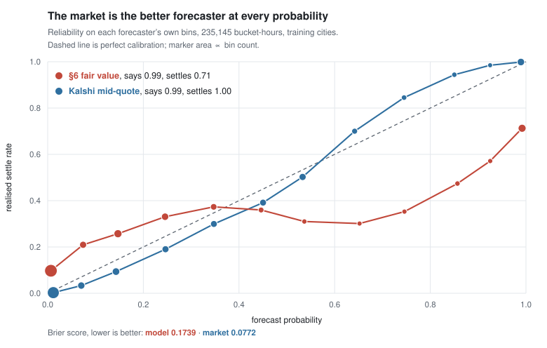

# Are Kalshi's daily temperature markets mispriced?

No. This repository is the pre-registered test that established it, and the
record of the test being run.

**The finding.** Over 235,145 evaluated bucket-hours, Kalshi's mid-quote scores a
Brier of 0.0772 against the strategy model's 0.1739, better than twice as
accurate, and the better forecast in every probability bin. That gap is the
conservative version, because the quote is scored on the pre-registered punitive
fill pair instead of a closing mid, which costs the market 0.0089 of Brier
(`check_calibration.log:60-63`). On held-out cities the strategy lost money in
all three trade shapes and all four seasons, and the pre-registered kill
criterion triggered in every stratum (`check_calibration.log:5,44,45`;
`test_b_holdout.log:13-15,23-29`).

The run's stdout is committed under [`scratch/`](scratch/), and every
measurement in _What was measured_ below cites the log line that produced it, so
none of it has to be taken on trust.



Where the model says 0.99, the bucket settles 0.71. Where the market says 0.99,
it settles 1.00. The dashed line is perfect calibration; marker area is bin
count. Regenerate with `python make_figures.py`, from
[`figures/calibration.json`](figures/calibration.json), which is written by
[`check_calibration.py`](check_calibration.py) and logged at
[`scratch/check_calibration.log`](scratch/check_calibration.log).

---

## The hypothesis, and how it was tested

Kalshi daily temperature markets settle on one named source's daily maximum.
Intraday, the observations feeding that source are public. By late afternoon the
day's high is substantially determined by readings already recorded. So price
the residual warming against the market, and trade the disagreement.

Two tests, both fixed in writing before any backtest data existed:

- **Test A, the safety test.** Can a bucket the observations have already ruled
  out still settle Yes? This gates everything, because the thesis leans on that
  floor holding.
- **Test B, the strategy.** Fit a residual-warming table on training cities
  only, freeze the rule, then run it once on held-out cities.

[`PREREGISTRATION.md`](PREREGISTRATION.md) is the binding spec, covering the
entry rule, fee model, fill assumption, train/holdout split, and five kill
criteria.

**What "pre-registered" means here, and what it does not.** The order is real
and it bound. The holdout ran once, and no threshold, cell key or fill
assumption was changed after it was seen. The gap is nine minutes, the spec at
00:46 and the first fetch script at 00:55, with the holdout run at 11:41 and the
last measurement (the quote-construction check) committed at 13:35, all on
2026-08-27. Those timestamps come from the original commit history; the
repository was republished as a single commit on 2026-08-29, so they are stated
here rather than checkable. That is a commitment device against fitting a rule
to data already in hand, and it is not the months-ahead registration the word
carries in clinical research. Nobody should read it as that.

## What was measured

| | | traceable to |
|---|---|---|
| Universe | 21 daily city max-temperature series | `fetch_hist2.log:67` |
| Settled markets | 60,906 across two API tiers | `fetch_hist2.log:99` |
| Settled city-days | 10,677 over 1,843 dates, 2021-08-06 → 2026-08-25 | `test_a.log:4` |
| Observations | 6,821,602 hourly ASOS rows (6,780,268 usable), 21 stations, 1995 → 2026 | `fetch_obs_totals.log:24` |
| Holdout | 9 cities, 19,348 trades, 1,463 dates | `test_b_holdout.log:32` |
| Parser check | 57,956 agree, 0 disagree; 2,950 strike-less, of which 2,949 recovered and 1 genuinely unbounded | `buckets_validation.log:3-6` |

**Test A, the observation floor leaks.** On the NWS settlement regime,
dominated buckets settled Yes on 511 of 274,552 bucket-hours (0.1861%), worst in
spring at 0.3930% with a date-clustered CI reaching 0.5548%, past the 0.5% kill
line set in `PREREGISTRATION.md` §5 (`test_a.log:94,96`). On the newer Weather
Company regime, zero violations over 5,169 bucket-hours, but from only twelve
dates (`test_a.log:92`). Over half of eligible city-days sit within 2 °F of a
flip in both regimes, 52.1% on TWC and 64.3% on NWS, so the clean record is thin
(`test_a.log:63,65`).

**Test B, negative everywhere on holdout.**

| Shape | trades | ¢/contract | settle accuracy | traceable to |
|---|---|---|---|---|
| dominated-bucket sell | 78 | −23.46¢ | 94.9% vs 98.1% needed | `test_b_holdout.log:13,17` |
| mid-bucket buy | 7,819 | −9.06¢ | 11.1% | `test_b_holdout.log:14` |
| other | 11,451 | −8.38¢ | 62.8% | `test_b_holdout.log:15` |

Every 95% interval wholly below zero, on both the naive and the date-clustered
bootstrap. Every season negative, at winter −10.69¢, spring −8.51¢, summer
−8.12¢, autumn −8.03¢ (`test_b_holdout.log:23-29`, per-season verdicts at
`:50-53`).

**Why it lost.** A losing backtest is either an efficient market or a broken
estimator, and only a calibration curve separates them. It was both.

1. *The observation-to-settlement offset does not cancel.* Checkpoint 1 argued it
   would. It re-enters at bucket membership, where the settled value runs
   +0.72 °F above the final observed max with sd 0.74 on the NWS stratum, +0.86
   with sd 0.67 on TWC (`test_a.log:24,26`). A +1 °F recentring cuts worst
   calibration error 0.397 → 0.209 without fixing it, because the problem is
   dispersion as much as location (`check_calibration.log:19,35,37`). That
   recentring was measured and not applied. Changing the rule to chase a
   diagnostic after the holdout is precisely what §8 kills.
2. *The entry rule is an error-maximiser.* Trading where |fair − quote| ≥ 10¢ and
   taking the largest edge, both fixed in `PREREGISTRATION.md` §6 before any
   data existed, selects on maximum disagreement with the market. When the model
   is the worse forecaster, that is maximum model error, which is why mid-bucket
   buys settle at 11.1% (`test_b_holdout.log:14`) while the model's 0.95+ bin
   settles at 0.713 (`check_calibration.log:18`).

No rule was changed after the holdout was seen. No threshold lowered, no cell key
altered, no fill assumption relaxed.

## The conduct record

[`METHOD.md`](METHOD.md) carries what I verified against a primary source, with
the date on each item, and the convention this repository follows for
corrections, which are appended and dated below the text they retract. What that
looks like in practice, all of it in the committed record:

- An early pass asserted that no archive of settled markets existed, on the
  evidence of one empty query. It was false, and it would have capped the sample
  at 68 days instead of 1,843 dates. Correction 1 retracts it, and the false
  sentence is still there, above it, unedited.
- `METHOD.md`'s ledger records me making that same generalisation from a single
  empty ticker a second time, four hours after writing down the check against it.
- Two silent schema bugs dropped 52,704 markets and 2,950 strike-less
  contracts, caught by a date count that looked wrong. No check I had built
  caught them. Documented in `RESULTS.md` §5, and every pull now reconciles rows
  retrieved against rows parsed.
- [`stations.py`](stations.py) halts for a human to read the station map before
  anything downstream runs. It earned that on first use. Houston resolves to
  Hobby, not Bush, and Chicago to Midway, not O'Hare. The wrong airport would
  have manufactured floor violations out of nothing.
- `RESULTS.md` keeps three caveats that would have been load-bearing had the
  verdict gone the other way (a measured ~11¢ noise floor on max-over-cells
  statistics, the Weather Company regime's twelve-date record, and its spring
  blind spot) and a dated correction for rounding 6,821,602 up to "6.9M".

## Reproducing it

Python 3.11+ (uses `zoneinfo`). One external dependency. No API keys, no paid
data, no account, since every endpoint used is unauthenticated and public.

```bash
pip install -r requirements.txt

python fetch_markets.py     # settled market universe, both API tiers
python stations.py          # proposes the station map, then stops for a human to read it
python fetch_obs.py         # hourly ASOS observations, one CSV per station
python fetch_candles.py     # hourly candlesticks; resumable, this is the long pull
python test_a.py            # the safety test
python test_b.py --fit      # fit on training cities, freeze the rule
python test_b.py --holdout  # run once
python check_calibration.py # reliability curves and model-vs-market Brier
```

Two checks read the existing cache and pull nothing, so they can be re-run in
seconds against a populated `data/`. `python buckets.py` reprints the
strike-ladder parser validation, and `python fetch_obs.py --summary` reprints
the observation totals.

Raw API responses land on disk unmodified before anything parses them, so every
downstream result is reproducible from cache without re-pulling. The full pull is
on the order of 10⁴ requests and takes a few hours; `scratch/` holds the stdout
of the run that produced `RESULTS.md`, so the numbers can be checked against
their logs without re-running anything.

| | |
|---|---|
| `common.py` | HTTP session, caching, raw-response persistence |
| `buckets.py` | strike-ladder parsing and bucket membership; run it to reprint the parser validation |
| `check_calibration.py` | reliability curves, Brier decomposition, model vs. market |
| `check_depth_bias.py` | whether deepening the observation archive trades variance for bias |
| `make_figures.py` | renders `figures/calibration.svg`; no dependencies |
| `PREREGISTRATION.md` | the binding spec, append-only, with its corrections |
| `RESULTS.md` | what was measured |
| `METHOD.md` | what I verified about the Kalshi API, and how corrections are handled |
| `scratch/` | run logs, see [`scratch/README.md`](scratch/README.md) |

The `data/` cache is not committed; the fetch steps rebuild it.

## Sibling study

The same method applied to Kalshi's NFL and NBA player-prop markets is at
https://github.com/anaborne/kalshi-prop-calibration. There the pre-registered
statistic passed, and the pass was traced to a measurement artifact in the
venue's own mid-quote, so the two studies fail in different ways and are best
read together.

## Scope

This is Stage 3 of a longer piece of work, and `PREREGISTRATION.md` refers in
passing to a private planning doc that governs it. The two clauses this test
depends on are quoted in full at the top of `PREREGISTRATION.md`, so nothing
here requires a document you cannot read. The same note records the redactions
made before publication, all of them to personal circumstance and hardware, none
to the spec.

Not investment advice.
